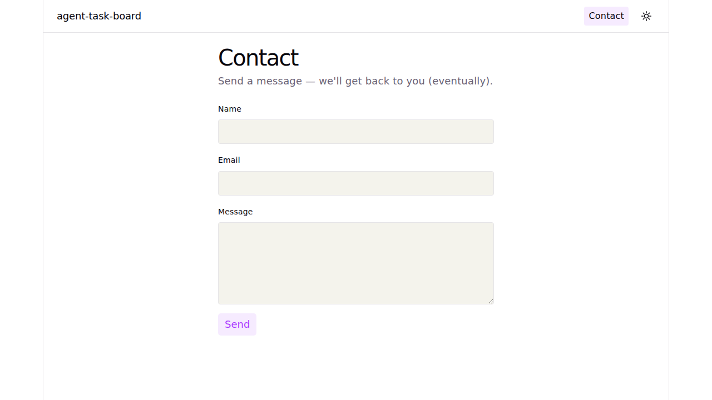
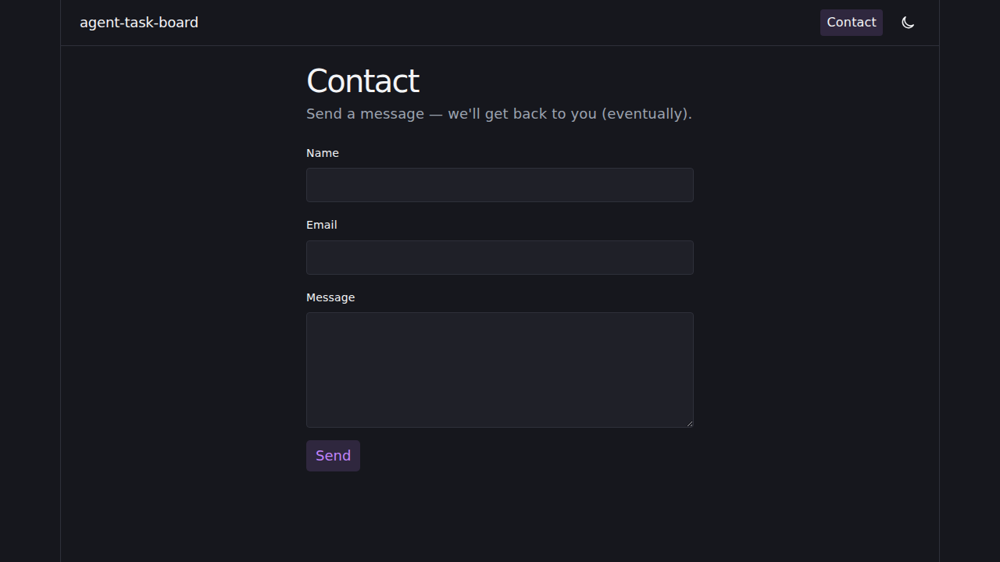
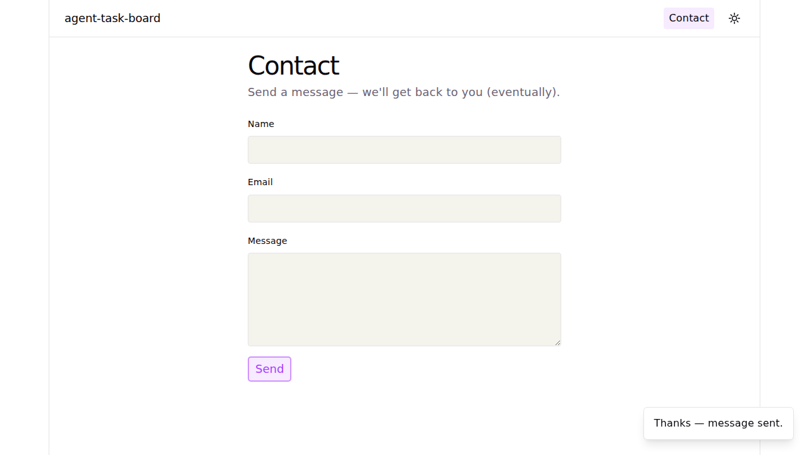
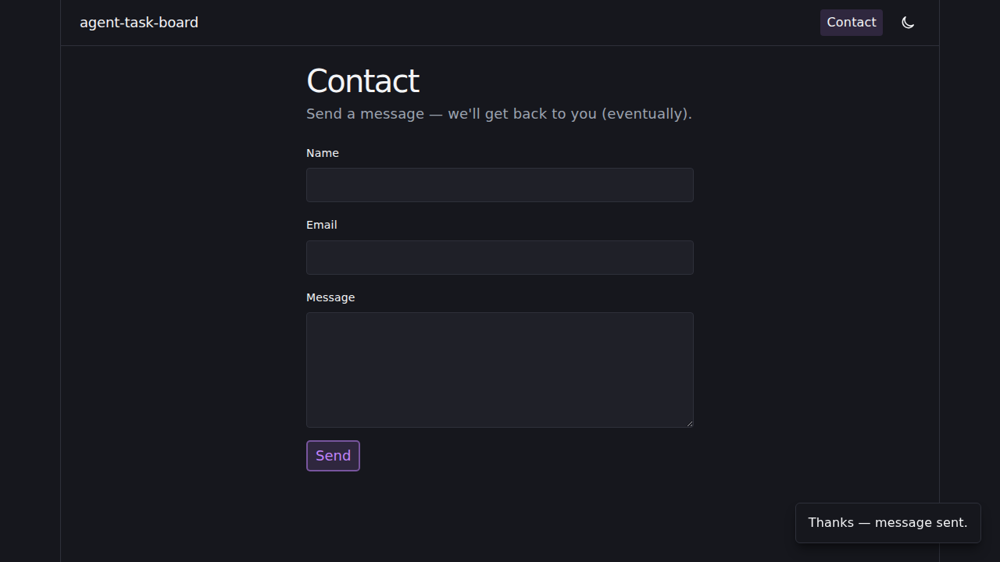
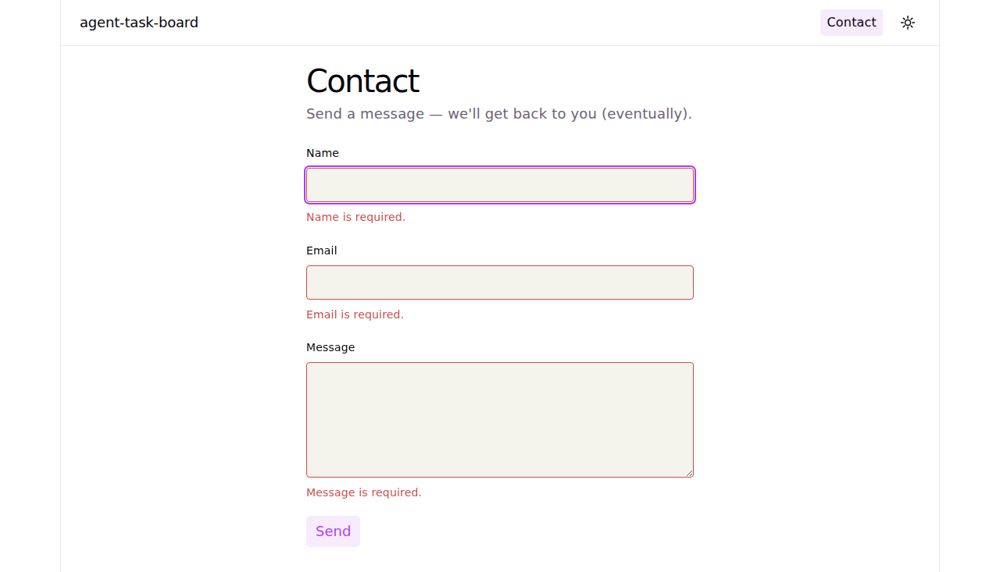

# Issue #19 — Contact Form Page · Review Report

Playwright end-to-end verification of the `/contact` route shipped in
`feat(contact): add /contact page with form, in-house toast, router`
(branch `adt/issue-19-add-a-contact-form-page`).

## Summary

- **15/15 e2e tests pass** (Chromium, 1280×800 viewport, full-page captures).
- **92/92 unit tests pass** (`npm test`, including the 9 new `validateContactForm` cases).
- **TS build clean** (`npm run build`).
- **One in-flight bug caught and fixed by the e2e suite:** the form's
  per-field focus-on-first-invalid logic captured `ref.current` during
  render, when refs are `null`. Fixed by looking refs up at submit time
  so the first invalid field actually receives focus.

## What the e2e suite covers

| # | Test | Asserts |
|---|---|---|
| 1 | Home page renders hero + counter + contact link | `h1` shows `Get started`; counter button visible & clickable; `Contact` link points at `/contact` |
| 2 | Home page — light mode screenshot | Full-page capture of `/` in light theme |
| 3 | Home page — dark mode screenshot | Full-page capture of `/` in dark theme |
| 4 | Contact page renders all three fields + submit | `Contact` h1, `Name` / `Email` / `Message` labels, `Send` button all visible |
| 5 | Contact link in header navigates to `/contact` | Click navigates; URL ends with `/contact`; `aria-current="page"` set on the nav link |
| 6 | Contact page — light mode screenshot | Full-page capture of `/contact` in light theme |
| 7 | Contact page — dark mode screenshot | Full-page capture of `/contact` in dark theme |
| 8 | Empty submit blocked, per-field errors shown | URL stays on `/contact`; `#contact-name-error`, `#contact-email-error`, `#contact-message-error` visible; `aria-invalid="true"` on every field; focus moves to the first invalid field |
| 9 | Invalid email shows only the email error | Submitting `not-an-email` produces just the email-format error |
| 10 | Valid submit clears fields + shows success toast | `role="status"` `aria-live="polite"` toast appears; all three fields return to empty; toast auto-dismisses after the 3 s timer |
| 11 | Contact toast screenshot (light) | Full-page capture showing the success toast in light theme |
| 12 | Contact toast screenshot (dark) | Full-page capture showing the success toast in dark theme |
| 13 | Contact errors screenshot (light) | Full-page capture of the empty-submit error state |
| 14 | Dark-mode toggle re-themes the contact page | Clicking the theme toggle changes `data-theme` and the `--bg` CSS variable resolves to `#16171d` |
| 15 | Unknown route redirects to `/` | Navigating to `/does-not-exist` lands on `/` with the home h1 |

## Test results

| Suite | Pass | Fail | Skipped | Notes |
|---|---|---|---|---|
| Playwright e2e (`tests/e2e/review.spec.ts`) | 15 | 0 | 0 | `npx playwright test` |
| Vitest unit (`npm test`) | 92 | 0 | 0 | `tests/unit/**` only — `tests/e2e/` is excluded by `vitest.config.ts` |
| `tsc --build` (`npm run build`) | ✅ | — | — | No type errors |

## Screenshots

### Home — light mode


### Home — dark mode


### Contact — light mode



### Contact — dark mode



### Contact — success toast (light)



### Contact — success toast (dark)



### Contact — per-field errors (light)



## Full HTML report

The complete Playwright run report (with stack traces, traces, and timing) is at:

[`../../../playwright-report/index.html`](../../../playwright-report/index.html)

Open it locally after `npx playwright show-report` or directly via a static
file server.

## How to reproduce

```bash
npm install
npm test                                       # unit tests
npx playwright install chromium                # one-time browser download
npx playwright test --reporter=html            # e2e + screenshots
```

The Playwright harness boots the Vite dev server on port **5174** (5173 was
occupied by an unrelated stale process on this host).